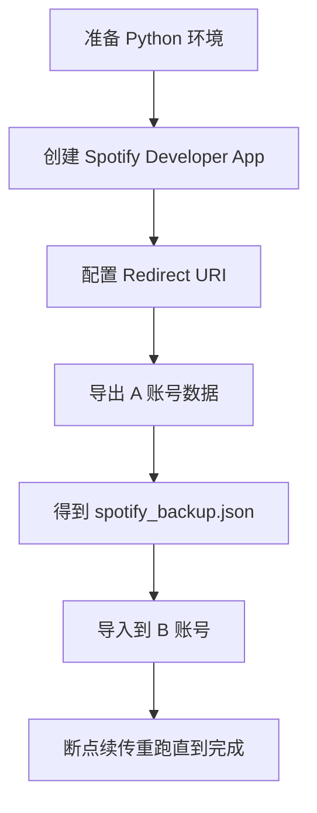

# Spotify Account Migrator 🎵

把 Spotify A 账号的歌单、喜欢歌曲、已保存播客单集迁移到 B 账号。

## 5 分钟上手 🚀

1. 安装依赖（见下方“安装”章节）。
2. 确保创建 App 的 Spotify 账号本身有有效 Premium，再去 Spotify 开发者后台创建 App，并配置 `https://example.com/callback`。
3. 复制 `.env.example` 为 `.env`，填入 Client ID / Client Secret。
4. 运行导出脚本并登录 A 账号。
5. 运行导入脚本并登录 B 账号。

## 功能 ✨

- 导出歌单（支持歌单中的 `track` 和 `episode`）
- 导出喜欢歌曲（Liked Songs）
- 导出库内已保存播客单集（Your Episodes）
- 导入时自动去重
- 导入时支持断点续传

## 先看限制 ⚠️

- Spotify 官方 API 不支持歌单文件夹层级迁移。
- 迁移后歌单会在目标账号根目录，需要手动整理文件夹。
- 如果看到 `Active premium subscription required for the owner of the app`，说明开发模式 App 的所有者账号缺少有效 Premium。

## 运行环境 🧱

- Python 3.9+
- macOS / Linux / Windows（PowerShell）

## 快速流程图 🧭



## 1. 安装 🛠️

macOS / Linux:

```bash
python3 -m pip install -r requirements.txt
```

Windows (PowerShell):

```powershell
py -m pip install -r requirements.txt
```

## 2. 新手：去 Spotify 开发者后台拿凭据 🧑‍💻

1. 打开 https://developer.spotify.com/dashboard 并登录。
2. 点击 `Create app`。
3. 填写：
   - App name：任意
   - App description：任意
4. 确认创建这个 App 的 Spotify 账号是 Premium。
5. 在 `Redirect URIs` 添加：
    - `https://example.com/callback`
6. 保存后进入 `Settings`，复制：
    - `Client ID`
    - `Client secret`
7. 打开 Spotify for Developers Dashboard 里的项目页面，进入 `User Management`（有些界面显示为 `Users and Access`）。
8. 点击 `Add user`，把你自己要登录和测试的 Spotify 账号邮箱加进去（开发模式必须）。

如果你刚开通或恢复 Premium，但仍收到 `Active premium subscription required for the owner of the app`，通常要等几小时再重试。

## 3. 配置 `.env` 文件 🔐

先复制模板文件（macOS / Linux）：

```bash
cp .env.example .env
```

Windows (PowerShell):

```powershell
Copy-Item .env.example .env
```

然后编辑 `.env`，填入：

```dotenv
SPOTIFY_CLIENT_ID=你的ClientID
SPOTIFY_CLIENT_SECRET=你的ClientSecret
```

安全提醒：`.env` 包含密钥，不要上传到公开仓库。

## 4. 导出 A 账号 📤

macOS / Linux:

```bash
python3 export_spotify.py --show-dialog
```

Windows (PowerShell):

```powershell
py export_spotify.py --show-dialog
```

- 浏览器会弹授权页，务必登录 A 账号。
- 完成后会生成 `spotify_backup.json`。

## 5. 导入 B 账号 📥

macOS / Linux:

```bash
python3 import_spotify.py --show-dialog
```

Windows (PowerShell):

```powershell
py import_spotify.py --show-dialog
```

- 浏览器授权时务必登录 B 账号。
- 脚本会自动去重，只增量导入。
- 中断后直接重跑同一命令即可断点续传。

## 常用参数 🧩

### export_spotify.py

- `--output` 导出文件名，默认 `spotify_backup.json`
- `--cache-path` token 缓存路径，默认 `.cache-export-spotify`
- `--redirect-uri` 默认 `https://example.com/callback`
- `--env-file` 凭据文件路径，默认 `.env`

### import_spotify.py

- `--input` 备份文件路径，默认 `spotify_backup.json`
- `--checkpoint` 断点文件路径，默认 `spotify_import_checkpoint.json`
- `--cache-path` token 缓存路径，默认 `.cache-import-spotify`
- `--env-file` 凭据文件路径，默认 `.env`

## 常见问题 ❓

### 1) 403 / user may not be registered 🚫

- 确认 Spotify for Developers Dashboard 的项目页面里，`User Management`（或 `Users and Access`）已经通过 `Add user` 添加了当前账号邮箱。
- 确认脚本使用的 Client ID 就是你刚配置的那个 App。

### 2) 403 / Active premium subscription required for the owner of the app 💳

- 这是 Spotify 2026 开发模式的新限制，不是脚本参数问题。
- 创建这个 App 的 Spotify 账号本身必须有有效 Premium。
- 如果你刚开通或恢复 Premium，等待几小时后再试。

### 3) 歌单里有播客，但 saved episodes 是 0 🎙️

- 正常现象。
- `saved_episodes` 统计的是库里点过“保存”的播客单集，不等于“播客歌单里的条目数量”。

### 4) 如何从头再导一次 🔁

删除以下文件后重跑：

macOS / Linux:

```bash
rm -f .cache-export-spotify .cache-import-spotify spotify_import_checkpoint.json spotify_backup.json
```

Windows (PowerShell):

```powershell
Remove-Item .cache-export-spotify,.cache-import-spotify,spotify_import_checkpoint.json,spotify_backup.json -ErrorAction SilentlyContinue
```
